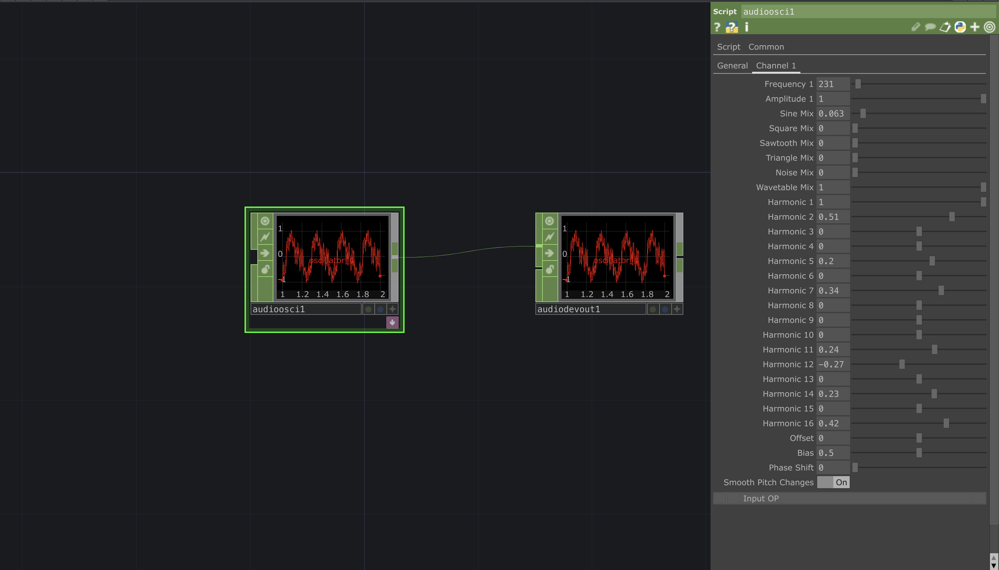

# Script-Based Audio Oscillator for TouchDesigner

---

---

## Documentation

AdvancedAudioOscillatorCHOP  

**Summary**

The AdvancedAudioOscillatorCHOP is a multi-voice, script-based oscillator for procedural audio synthesis. Implemented in Python using the Script CHOP, it supports per-voice waveform mixing, harmonic wavetable synthesis, and BLEP anti-aliasing. It outputs signals at audio or control rates and provides dynamically generated channel parameter pages.

The oscillator blends six waveform types (sine, square, sawtooth, triangle, noise, wavetable), supports additive harmonic shaping, and includes filtering. It does not require any input CHOPs and operates entirely via custom parameters.

Unlike the built-in Audio Oscillator CHOP, which offers a fixed waveform per output and limited modulation capabilities, this CHOP is modular, programmable, and designed for advanced sound synthesis or complex control signal generation.

See also: [Audio Oscillator CHOP](https://derivative.ca/UserGuide/Audio_Oscillator_CHOP)  , [LFO CHOP](https://derivative.ca/UserGuide/LFO_CHOP)  , [Pattern CHOP](https://derivative.ca/UserGuide/Pattern_CHOP)  .

---

Contents  
- Summary  
- Parameters – General Page  
- Parameters – Channel Pages  
- Output Behaviour  
- Audio Features  
- Operator Inputs  
- Info CHOP Channels  
- Common CHOP Info Channels  
- Common Operator Info Channels  
- Repository & Usage
- White-paper
---

Parameters – General Page  
Samplerate – The sample rate of the output signals in samples per second. Default: 44100.  
Numchannels – Number of oscillator voices. One output channel and UI page is created per voice.  
Numsamples – Number of samples output per cook.  
Transitiontime – Duration in seconds before oscillator output begins. Useful for synchronisation.  
Absolutetime – Absolute time (in frames). Read-only.  
Updatechannels – Pulse to regenerate per-voice parameter pages.

---

Parameters – Channel Pages  
Each oscillator voice includes the following controls:

Frequency – Oscillator pitch in Hz.  
Amplitude – Output amplitude of the oscillator.  
Sinemix – Gain for the sine waveform.  
Squaremix – Gain for the BLEP-corrected square waveform.  
Sawtoothmix – Gain for the BLEP-corrected sawtooth waveform.  
Trianglemix – Gain for the triangle waveform, integrated from square.  
Noisemix – Gain for white noise.  
Wavetablemix – Gain for the additive wavetable.  
Harmonic1–16 – 16 parameters to define the amplitude of each partial in the wavetable.  
Offset – DC offset applied to the waveform.  
Bias – Pulse width for square, shape skew for triangle.  
Phase – Initial phase shift (0–1).  
Smooth – Toggles sample-accurate pitch modulation.

---

Output Behaviour  
Output channels are named `oscillator_1`, `oscillator_2`, etc., based on the number of active voices. Audio is generated using custom synthesis routines per frame. A one-pole low-pass filter (cutoff: 8kHz) is applied to each output to reduce aliasing artefacts.

---

Audio Features  
- Polynomial BLEP correction for alias-free square and sawtooth  
- Additive harmonic wavetable synthesis  
- White noise generator  
- Triangle synthesis via integration  
- Per-voice filter and offset control  
- Dynamic custom parameter UI creation

---

Operator Inputs  
Input 0: –  
Input 1: –  
Input 2: –  
(This operator does not accept external CHOP inputs. All modulation is internal via parameters.)

---

Info CHOP Channels  
Extra Information for the AdvancedAudioOscillatorCHOP can be accessed via an Info CHOP.

Common CHOP Info Channels  
start – Start of the CHOP interval in samples.  
length – Number of samples in the CHOP.  
sample_rate – The samplerate of the channels in frames per second.  
num_channels – Number of output channels.  
time_slice – 1 if CHOP is Time Slice enabled, 0 otherwise.  
export_sernum – Serial number of export changes.

Common Operator Info Channels  
total_cooks – Number of times the operator has cooked.  
cook_time – Duration of last cook in milliseconds.  
cook_frame – Timeline-relative frame number of last cook.  
cook_abs_frame – Absolute frame number of last cook.  
cook_start_time – Start time of last cook in ms.  
cook_end_time – End time of last cook in ms.  
cooked_this_frame – 1 if cooked this frame.  
warnings – Number of current warnings.  
errors – Number of current errors.

---

TouchDesigner Build: 2022.2+  
Category: CHOPs – Script CHOP

## Repository

TouchDesigner offers a modular node-based environment primarily focused on real-time visual programming. While it provides basic audio synthesis functionalities, such as the built-in [Audio Oscillator CHOP](https://docs.derivative.ca/Audio_Oscillator_CHOP), these are inherently limited in scope, lacking the expressive depth and granularity typically expected by sound artists or interactive system designers. This project introduces a fully script-based, extensible, and modular audio oscillator built from the ground up using the Script CHOP. It leverages Python and NumPy to create a synthesis engine that not only replicates but surpasses the functionality of standard CHOPs.

## Installation

1. Clone the repository or download ZIP  
2. Open `example_project.toe` in **TouchDesigner**  
3. Ensure Python module `NumPy` is available (TD >= 2022)  
4. Run project and adjust channels using custom parameter UI

> 💡 You may need to manually reload script CHOP for parameter updates.

---

## Usage

- Use `Numchannels` to set the number of oscillator voices  
- Press `Update Channels` pulse to refresh pages  
- Adjust waveform mix sliders and harmonic levels  
- Automate parameters via CHOP exports (LFOs, Noise, Audio In, etc.)  
- Route final output to `Audio Device Out CHOP` for monitoring  

---

## Credits

- Developed by [@saimgulay](https://github.com/saimgulay)  
- Inspired by modular synthesis tools such as Max/MSP, VCV Rack, and SuperCollider  
- TouchDesigner by Derivative

---

## License

This project is released under the MIT License. You are free to use, modify, and distribute it with attribution.

---

Feel free to fork the repository and contribute enhancements such as:
- ADSR envelope modules  
- External MIDI control  
- Spectral shaping  
- GPU-based implementation  

## Motivation

The default Audio Oscillator CHOP, although useful for quick prototyping, is constrained to single waveform outputs with minimal parameter control. For artists and developers working on generative audio, live A/V performances, or synaesthetic installations, such limitations prove restrictive. The motivation behind this work is to unlock more creative potential within TouchDesigner by implementing a custom, modular synthesis engine capable of:

- Real-time waveform mixing  
- Wavetable synthesis via harmonic construction  
- Anti-aliasing via BLEP  
- Multi-channel parallel oscillation  
- Fully script-based customisability  

This aims to bring TouchDesigner’s audio capabilities closer to that of environments such as Max/MSP or SuperCollider, while maintaining the integrative strengths of its visual programming paradigm.

---

## Justification

The decision to build a script-based oscillator within TouchDesigner is rooted in the desire for full transparency, flexibility, and scalability. While external VSTs or third-party tools can be integrated into TouchDesigner, they often introduce latency, platform dependence, and black-box behaviours. This oscillator, in contrast, offers:

- Full source code transparency and modifiability  
- Integration with CHOP networks for real-time parameter modulation  
- Synchronisation with visuals and sensors without external middleware  
- A procedural and data-driven synthesis model that complements TD’s generative paradigm  

Additionally, from a pedagogical perspective, this project serves as a demonstrator for users interested in extending TouchDesigner’s capabilities through Python scripting.

---

## Prototype

The prototype is implemented as a Script CHOP that dynamically builds channel-specific control pages, allowing users to define multiple parallel oscillators with full per-channel parameterisation. Key features include:

- **Mixer-based waveform blending:** Each oscillator mixes six waveforms (Sine, Square, Sawtooth, Triangle, Noise, and Wavetable) with independent gain sliders.  
- **Additive harmonic synthesis:** Each wavetable is constructed from 16 harmonics, which the user can manipulate directly for timbral control.  
- **Anti-aliasing:** PolyBLEP is implemented for saw and square waveforms to eliminate high-frequency artefacts.  
- **Dynamic UI generation:** Parameters are auto-generated per channel, including frequency, amplitude, offset, bias, phase, smooth pitch toggle, etc.  
- **One-pole filtering:** A simple low-pass filter is applied for smoothing audio outputs.  
- **Transition state logic:** A time-delayed start condition is implemented to enable seamless integration in reactive networks.  

This modular structure makes it possible to emulate LFOs, audio oscillators, and even create custom modulations for control-rate outputs.

---

## Challenges

### Lack of Documentation and Nature of Operator Scripting

Developing this oscillator required navigating a significant gap in TouchDesigner’s documentation, particularly around Script CHOPs. Unlike visual operators, scripted nodes lack comprehensive cook-cycle examples, parameter-building tutorials, or best practices for state management. Key issues included:

- Undocumented behaviours in `scriptOp.numSamples` vs `isTimeSlice`  
- Conflicting information on persistent state across cooks  
- No clear examples of dynamic parameter UI creation at runtime  
- Difficulties in debugging real-time audio buffers without artefacting  

Furthermore, Python scripting in TouchDesigner—especially involving NumPy and real-time audio—operates in a constrained sandbox that demanded careful performance optimisations and memory management.

---

## Testing (Expert-based)

Empathy mapping and expert-based feedback were employed rather than large-scale user testing, given the niche domain. The expert user profile was defined as:

- Experienced in real-time audio-visual systems  
- Familiar with Max/MSP or Reaktor  
- Able to script or work with CHOP-level modulation  
- Interested in modular and generative composition  

Experts highlighted several key positives:

- The polyBLEP anti-aliasing was perceptible and desirable  
- Wavetable harmonic sliders offered intuitive and immediate timbral shaping  
- Dynamic UI generation per channel was appreciated for clarity and control  
- The use of `UpdateChannels` and automatic state recovery avoided typical Script CHOP instability  

Recommendations included possible integration with external MIDI devices, envelope generators, or modulation buses.

---

## Evaluation

The system was evaluated against the following criteria:

| Metric               | Result                            |
|----------------------|-----------------------------------|
| Waveform fidelity    | High, with alias-free output      |
| UI scalability       | High, dynamic per-channel         |
| Audio quality        | Clear and consistent at 44.1kHz   |
| Performance (CPU)    | Acceptable with <10 channels      |
| Creative flexibility | High (mixer, harmonics, noise)    |
| Modulation capability| Full CHOP-based connectivity      |

The result is a significant improvement over the default Audio Oscillator CHOP in both capability and expressiveness.

---

## Future Development Recommendations

The AdvancedAudioOscillatorCHOP project provides a flexible foundation for real-time procedural audio in TouchDesigner. Several directions are currently under consideration for future development:

 ADSR Envelope Generator: Add per-channel envelope shaping modules with visual feedback.

 Modulation Matrix: Route internal or external LFOs and envelopes to oscillator parameters via a patchable matrix.

 FM / AM Support: Enable per-channel frequency or amplitude modulation with cross-routing options.

 MIDI Input Support: Trigger oscillator notes and modulation via external MIDI controllers or TouchDesigner’s MIDI In CHOP.

 Spectral Shaping: Implement convolution- or filterbank-based spectral morphing for wavetable output.

 Preset System: Allow users to save and load complete oscillator configurations.

 GPU Acceleration (experimental): Port audio synthesis routines to GLSL or CUDA for high-performance multi-voice synthesis.

 Live Visual Feedback: Include real-time waveform display and FFT analysis via connected TOPs or CHOP visualisers.

 OSC & Networked Modulation: Control oscillators remotely over network or OSC protocols.

Community contributions and feature requests are welcome via issues or pull requests.

## Discussion

The development of this oscillator script not only augments TouchDesigner’s internal audio synthesis tools but opens up broader possibilities for DSP within a visual programming context. By leveraging NumPy and advanced waveform modelling, it bridges the gap between procedural audio and real-time generative systems. The oscillator's:

- Mixer-style signal shaping  
- Real-time harmonic control  
- Sample-accurate pitch morphing  
- Modulation-readiness  

…position it as a viable core component for more complex systems—such as physical modelling synths, modular instrument chains, and sound-reactive installations.

In effect, this tool redefines what sound design in TouchDesigner can be—not merely reactive, but **generative, sculptable, and fully scriptable**. Its architecture provides a template for future expansions including envelope modules, modulation matrices, or even convolution-based spectral shaping.

