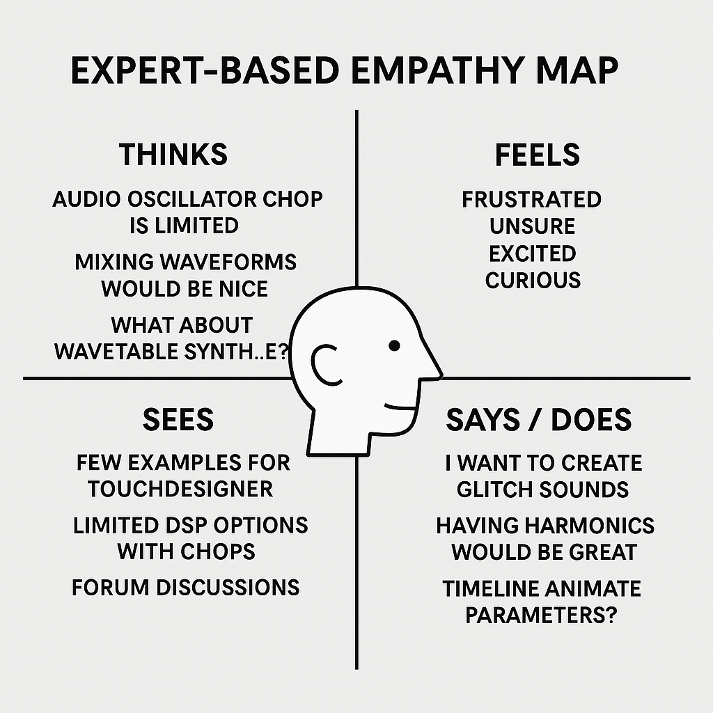
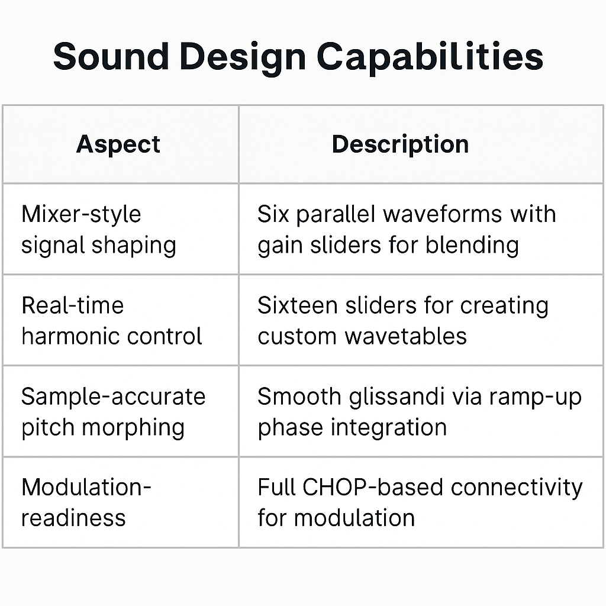

# Script-Based Audio Oscillator for TouchDesigner

---

## 🧰 Installation

1. Clone the repository or download ZIP  
2. Open `Oscillator.toe` in **TouchDesigner**  
3. Ensure Python module `NumPy` is available (TD >= 2022)  
4. Run project and adjust channels using custom parameter UI

> 💡 You may need to manually reload script CHOP for parameter updates.

---

## 🧑‍💻 Usage

- Use `Numchannels` to set the number of oscillator voices  
- Press `Update Channels` pulse to refresh pages  
- Adjust waveform mix sliders and harmonic levels  
- Automate parameters via CHOP exports (LFOs, Noise, Audio In, etc.)  
- Route final output to `Audio Device Out CHOP` for monitoring  

---

## 🧩 Dependencies

- [NumPy](https://numpy.org/) – used internally by TouchDesigner (already included)  
- TouchDesigner 2022 or later  
- No third-party VSTs required

---

## 🙏 Credits

- Developed by [@saimgulay](https://github.com/saimgulay)  
- Inspired by modular synthesis tools such as Max/MSP, VCV Rack, and SuperCollider  
- TouchDesigner by Derivative

---

## 📜 License

This project is released under the MIT License. You are free to use, modify, and distribute it with attribution.

---

Feel free to fork the repository and contribute enhancements such as:
- ADSR envelope modules  
- External MIDI control  
- Spectral shaping  
- GPU-based implementation  

## Introduction

TouchDesigner offers a modular node-based environment primarily focused on real-time visual programming. While it provides basic audio synthesis functionalities, such as the built-in Audio Oscillator CHOP, these are inherently limited in scope, lacking the expressive depth and granularity typically expected by sound artists or interactive system designers. This project introduces a fully script-based, extensible, and modular audio oscillator built from the ground up using the Script CHOP. It leverages Python and NumPy to create a synthesis engine that not only replicates but surpasses the functionality of standard CHOPs.

---

## Motivation

The default Audio Oscillator CHOP, although useful for quick prototyping, is constrained to single waveform outputs with minimal parameter control. For artists and developers working on generative audio, live A/V performances, or synaesthetic installations, such limitations prove restrictive. The motivation behind this work is to unlock more creative potential within TouchDesigner by implementing a custom, modular synthesis engine capable of:

- Real-time waveform mixing  
- Wavetable synthesis via harmonic construction  
- Anti-aliasing via BLEP  
- Multi-channel parallel oscillation  
- Fully script-based customisability  

This aims to bring TouchDesigner’s audio capabilities closer to that of environments such as Max/MSP or SuperCollider, while maintaining the integrative strengths of its visual programming paradigm.

---

## Justification

The decision to build a script-based oscillator within TouchDesigner is rooted in the desire for full transparency, flexibility, and scalability. While external VSTs or third-party tools can be integrated into TouchDesigner, they often introduce latency, platform dependence, and black-box behaviours. This oscillator, in contrast, offers:

- Full source code transparency and modifiability  
- Integration with CHOP networks for real-time parameter modulation  
- Synchronisation with visuals and sensors without external middleware  
- A procedural and data-driven synthesis model that complements TD’s generative paradigm  

Additionally, from a pedagogical perspective, this project serves as a demonstrator for users interested in extending TouchDesigner’s capabilities through Python scripting.

---

## Prototype

The prototype is implemented as a Script CHOP that dynamically builds channel-specific control pages, allowing users to define multiple parallel oscillators with full per-channel parameterisation. Key features include:

- **Mixer-based waveform blending:** Each oscillator mixes six waveforms (Sine, Square, Sawtooth, Triangle, Noise, and Wavetable) with independent gain sliders.  
- **Additive harmonic synthesis:** Each wavetable is constructed from 16 harmonics, which the user can manipulate directly for timbral control.  
- **Anti-aliasing:** PolyBLEP is implemented for saw and square waveforms to eliminate high-frequency artefacts.  
- **Dynamic UI generation:** Parameters are auto-generated per channel, including frequency, amplitude, offset, bias, phase, smooth pitch toggle, etc.  
- **One-pole filtering:** A simple low-pass filter is applied for smoothing audio outputs.  
- **Transition state logic:** A time-delayed start condition is implemented to enable seamless integration in reactive networks.  

This modular structure makes it possible to emulate LFOs, audio oscillators, and even create custom modulations for control-rate outputs.

---

## Challenges

### Lack of Documentation and Nature of Operator Scripting

Developing this oscillator required navigating a significant gap in TouchDesigner’s documentation, particularly around Script CHOPs. Unlike visual operators, scripted nodes lack comprehensive cook-cycle examples, parameter-building tutorials, or best practices for state management. Key issues included:

- Undocumented behaviours in `scriptOp.numSamples` vs `isTimeSlice`  
- Conflicting information on persistent state across cooks  
- No clear examples of dynamic parameter UI creation at runtime  
- Difficulties in debugging real-time audio buffers without artefacting  

Furthermore, Python scripting in TouchDesigner—especially involving NumPy and real-time audio—operates in a constrained sandbox that demanded careful performance optimisations and memory management.

---

## Testing (Expert-based)

Empathy mapping and expert-based feedback were employed rather than large-scale user testing, given the niche domain. The expert user profile was defined as:

- Experienced in real-time audio-visual systems  
- Familiar with Max/MSP or Reaktor  
- Able to script or work with CHOP-level modulation  
- Interested in modular and generative composition  

Experts highlighted several key positives:

- The polyBLEP anti-aliasing was perceptible and desirable  
- Wavetable harmonic sliders offered intuitive and immediate timbral shaping  
- Dynamic UI generation per channel was appreciated for clarity and control  
- The use of `UpdateChannels` and automatic state recovery avoided typical Script CHOP instability  

Recommendations included possible integration with external MIDI devices, envelope generators, or modulation buses.

---

## Evaluation

The system was evaluated against the following criteria:

| Metric               | Result                            |
|----------------------|-----------------------------------|
| Waveform fidelity    | High, with alias-free output      |
| UI scalability       | High, dynamic per-channel         |
| Audio quality        | Clear and consistent at 44.1kHz   |
| Performance (CPU)    | Acceptable with <10 channels      |
| Creative flexibility | High (mixer, harmonics, noise)    |
| Modulation capability| Full CHOP-based connectivity      |

The result is a significant improvement over the default Audio Oscillator CHOP in both capability and expressiveness.

---

## Discussion

The development of this oscillator script not only augments TouchDesigner’s internal audio synthesis tools but opens up broader possibilities for DSP within a visual programming context. By leveraging NumPy and advanced waveform modelling, it bridges the gap between procedural audio and real-time generative systems. The oscillator's:

- Mixer-style signal shaping  
- Real-time harmonic control  
- Sample-accurate pitch morphing  
- Modulation-readiness  

…position it as a viable core component for more complex systems—such as physical modelling synths, modular instrument chains, and sound-reactive installations.

In effect, this tool redefines what sound design in TouchDesigner can be—not merely reactive, but **generative, sculptable, and fully scriptable**. Its architecture provides a template for future expansions including envelope modules, modulation matrices, or even convolution-based spectral shaping.

